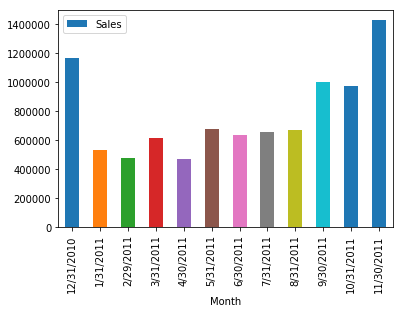

```python
import pandas as pd
import matplotlib as mpl
import numpy as np

df = pd.read_csv('data.csv', header=0, sep=',', encoding='latin1')
df.head(5)
```


<div>
<style scoped>
    .dataframe tbody tr th:only-of-type {
        vertical-align: middle;
    }

    .dataframe tbody tr th {
        vertical-align: top;
    }

    .dataframe thead th {
        text-align: right;
    }
</style>
<table border="1" class="dataframe">
  <thead>
    <tr style="text-align: right;">
      <th></th>
      <th>InvoiceNo</th>
      <th>StockCode</th>
      <th>Description</th>
      <th>Quantity</th>
      <th>InvoiceDate</th>
      <th>UnitPrice</th>
      <th>CustomerID</th>
      <th>Country</th>
    </tr>
  </thead>
  <tbody>
    <tr>
      <th>0</th>
      <td>536365</td>
      <td>85123A</td>
      <td>WHITE HANGING HEART T-LIGHT HOLDER</td>
      <td>6</td>
      <td>12/1/2010 8:26</td>
      <td>2.55</td>
      <td>17850.0</td>
      <td>United Kingdom</td>
    </tr>
    <tr>
      <th>1</th>
      <td>536365</td>
      <td>71053</td>
      <td>WHITE METAL LANTERN</td>
      <td>6</td>
      <td>12/1/2010 8:26</td>
      <td>3.39</td>
      <td>17850.0</td>
      <td>United Kingdom</td>
    </tr>
    <tr>
      <th>2</th>
      <td>536365</td>
      <td>84406B</td>
      <td>CREAM CUPID HEARTS COAT HANGER</td>
      <td>8</td>
      <td>12/1/2010 8:26</td>
      <td>2.75</td>
      <td>17850.0</td>
      <td>United Kingdom</td>
    </tr>
    <tr>
      <th>3</th>
      <td>536365</td>
      <td>84029G</td>
      <td>KNITTED UNION FLAG HOT WATER BOTTLE</td>
      <td>6</td>
      <td>12/1/2010 8:26</td>
      <td>3.39</td>
      <td>17850.0</td>
      <td>United Kingdom</td>
    </tr>
    <tr>
      <th>4</th>
      <td>536365</td>
      <td>84029E</td>
      <td>RED WOOLLY HOTTIE WHITE HEART.</td>
      <td>6</td>
      <td>12/1/2010 8:26</td>
      <td>3.39</td>
      <td>17850.0</td>
      <td>United Kingdom</td>
    </tr>
  </tbody>
</table>
</div>


```python
def CountSummary():
    orderedNo = df.loc[ (df['Quantity'] > 0)].count().InvoiceNo
    canceledNo = df.loc[ (df['Quantity'] < 0) & (df['InvoiceNo'].str[:1] == 'C')].count().InvoiceNo
    returnedNo = df.loc[ (df['Quantity'] < 0) & (df['InvoiceNo'].str[:1] != 'C')].count().InvoiceNo
    totalNo = df.loc[ (df['Quantity'] != 0)].count().InvoiceNo
    
    ordered_0_unitPriceNo = df.loc[ (df['Quantity'] > 0) & (df['UnitPrice'] == 0)].count().InvoiceNo
    canceled_0_unitPricedNo = df.loc[ (df['Quantity'] < 0) & (df['InvoiceNo'].str[:1] == 'C') & (df['UnitPrice'] == 0)].count().InvoiceNo
    returned_0_unitPricedNo = df.loc[ (df['Quantity'] < 0) & (df['InvoiceNo'].str[:1] != 'C') & (df['UnitPrice'] == 0)].count().InvoiceNo
    total_0_unitPriceNo = df.loc[(df['UnitPrice'] == 0.0)].count().InvoiceNo

    d = {'Count Type': ['Ordered', 'Canceled', 'Returned', 'Total'], 
         'Invoice Count': [orderedNo, canceledNo, returnedNo, totalNo],
         'Percentage': [orderedNo/totalNo, canceledNo/totalNo, returnedNo/totalNo, totalNo/totalNo],
         'UnitPrice=0': [ordered_0_unitPriceNo,canceled_0_unitPricedNo, returned_0_unitPricedNo, total_0_unitPriceNo]
         }
    dfNo = pd.DataFrame(data=d)
    print (dfNo)
    
print ('Before fixing UnitPrice column')
CountSummary()

```

    Before fixing UnitPrice column
      Count Type  Invoice Count  Percentage  UnitPrice=0
    0    Ordered         531285    0.980395         1179
    1   Canceled           9288    0.017139            0
    2   Returned           1336    0.002465         1336
    3      Total         541909    1.000000         2515
    


```python
def fix_returned_unitPrice(row, df):

    idx = row.name
    stkCode = df.iloc[idx].StockCode
    unitP = df.loc[(df.index < idx) & (df['StockCode'].str[:12] == stkCode) & (df['UnitPrice'] != 0.0)].tail(1)

    if (len(unitP) == 1) :
        #print ('unitPrice found: index(0)=', unitP.index[0], 'UnitPrice=', unitP.iloc[0].UnitPrice, ', stkCode=', stkCode, ', idx=', idx)
        df.loc[df.index == idx, 'UnitPrice'] =  unitP.iloc[0].UnitPrice
    #else :
    #    print ('not found UnitPrice index=', idx, 'stkCode=', stkCode)    
            

df0 = df.loc[(df['Quantity'] < 0) & (df['InvoiceNo'].str[:1] != 'C') & (df['UnitPrice'] == 0.0)].apply(
    lambda r: fix_returned_unitPrice(r, df), axis=1
)

print ('After fixing UnitPrice column')
CountSummary()
```

    After fixing UnitPrice column
      Count Type  Invoice Count  Percentage  UnitPrice=0
    0    Ordered         531285    0.980395         1179
    1   Canceled           9288    0.017139            0
    2   Returned           1336    0.002465          158
    3      Total         541909    1.000000         1337
    


```python
df['Sales']=df[['Quantity']].multiply(df['UnitPrice'], axis='index')
df.head(5)
```


<div>
<style scoped>
    .dataframe tbody tr th:only-of-type {
        vertical-align: middle;
    }

    .dataframe tbody tr th {
        vertical-align: top;
    }

    .dataframe thead th {
        text-align: right;
    }
</style>
<table border="1" class="dataframe">
  <thead>
    <tr style="text-align: right;">
      <th></th>
      <th>InvoiceNo</th>
      <th>StockCode</th>
      <th>Description</th>
      <th>Quantity</th>
      <th>InvoiceDate</th>
      <th>UnitPrice</th>
      <th>CustomerID</th>
      <th>Country</th>
      <th>Sales</th>
    </tr>
  </thead>
  <tbody>
    <tr>
      <th>0</th>
      <td>536365</td>
      <td>85123A</td>
      <td>WHITE HANGING HEART T-LIGHT HOLDER</td>
      <td>6</td>
      <td>12/1/2010 8:26</td>
      <td>2.55</td>
      <td>17850.0</td>
      <td>United Kingdom</td>
      <td>15.30</td>
    </tr>
    <tr>
      <th>1</th>
      <td>536365</td>
      <td>71053</td>
      <td>WHITE METAL LANTERN</td>
      <td>6</td>
      <td>12/1/2010 8:26</td>
      <td>3.39</td>
      <td>17850.0</td>
      <td>United Kingdom</td>
      <td>20.34</td>
    </tr>
    <tr>
      <th>2</th>
      <td>536365</td>
      <td>84406B</td>
      <td>CREAM CUPID HEARTS COAT HANGER</td>
      <td>8</td>
      <td>12/1/2010 8:26</td>
      <td>2.75</td>
      <td>17850.0</td>
      <td>United Kingdom</td>
      <td>22.00</td>
    </tr>
    <tr>
      <th>3</th>
      <td>536365</td>
      <td>84029G</td>
      <td>KNITTED UNION FLAG HOT WATER BOTTLE</td>
      <td>6</td>
      <td>12/1/2010 8:26</td>
      <td>3.39</td>
      <td>17850.0</td>
      <td>United Kingdom</td>
      <td>20.34</td>
    </tr>
    <tr>
      <th>4</th>
      <td>536365</td>
      <td>84029E</td>
      <td>RED WOOLLY HOTTIE WHITE HEART.</td>
      <td>6</td>
      <td>12/1/2010 8:26</td>
      <td>3.39</td>
      <td>17850.0</td>
      <td>United Kingdom</td>
      <td>20.34</td>
    </tr>
  </tbody>
</table>
</div>


```python
months = ['12/31/2010', '1/31/2011', '2/29/2011', '3/31/2011', '4/30/2011', '5/31/2011', '6/30/2011', '7/31/2011', '8/31/2011', '9/30/2011', '10/31/2011', '11/30/2011']
sales = [df.loc[(pd.to_datetime(df['InvoiceDate'], format='%m/%d/%Y %H:%M').dt.month == 12), 'Sales'].sum()]
for month in range(1, 12):
    sales.append(df.loc[(pd.to_datetime(df['InvoiceDate'], format='%m/%d/%Y %H:%M').dt.month == month), 'Sales'].sum())
df2 = pd.DataFrame( 
    {'Month': months,
     'Sales': sales
    })
df2
```


<div>
<style scoped>
    .dataframe tbody tr th:only-of-type {
        vertical-align: middle;
    }

    .dataframe tbody tr th {
        vertical-align: top;
    }

    .dataframe thead th {
        text-align: right;
    }
</style>
<table border="1" class="dataframe">
  <thead>
    <tr style="text-align: right;">
      <th></th>
      <th>Month</th>
      <th>Sales</th>
    </tr>
  </thead>
  <tbody>
    <tr>
      <th>0</th>
      <td>12/31/2010</td>
      <td>1165951.420</td>
    </tr>
    <tr>
      <th>1</th>
      <td>1/31/2011</td>
      <td>532412.500</td>
    </tr>
    <tr>
      <th>2</th>
      <td>2/29/2011</td>
      <td>480669.010</td>
    </tr>
    <tr>
      <th>3</th>
      <td>3/31/2011</td>
      <td>615465.820</td>
    </tr>
    <tr>
      <th>4</th>
      <td>4/30/2011</td>
      <td>471062.951</td>
    </tr>
    <tr>
      <th>5</th>
      <td>5/31/2011</td>
      <td>673501.490</td>
    </tr>
    <tr>
      <th>6</th>
      <td>6/30/2011</td>
      <td>636907.190</td>
    </tr>
    <tr>
      <th>7</th>
      <td>7/31/2011</td>
      <td>659558.081</td>
    </tr>
    <tr>
      <th>8</th>
      <td>8/31/2011</td>
      <td>667556.090</td>
    </tr>
    <tr>
      <th>9</th>
      <td>9/30/2011</td>
      <td>1001749.382</td>
    </tr>
    <tr>
      <th>10</th>
      <td>10/31/2011</td>
      <td>975139.670</td>
    </tr>
    <tr>
      <th>11</th>
      <td>11/30/2011</td>
      <td>1424235.390</td>
    </tr>
  </tbody>
</table>
</div>


```python
df2.plot(kind='bar', x=df2['Month'], y='Sales')
```


    <matplotlib.axes._subplots.AxesSubplot at 0x25b21387518>




